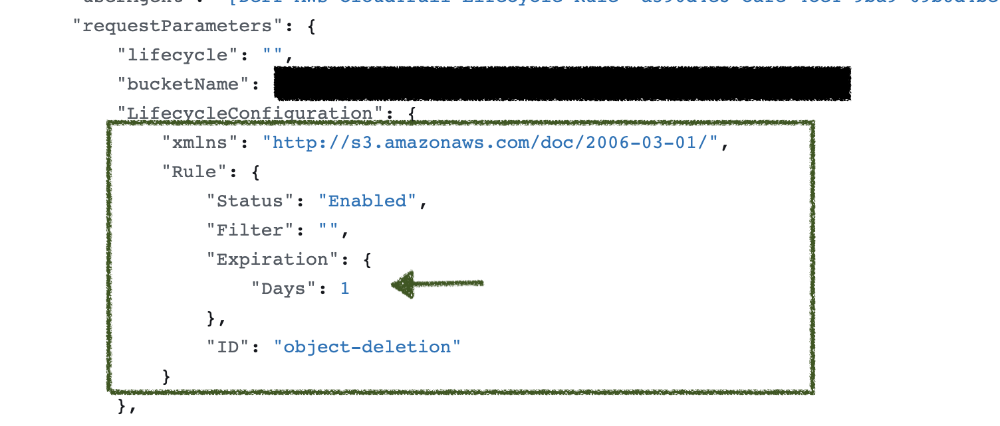

# CloudTrail Logs Impairment Through S3 Lifecycle Rule


Platform: AWS

## MITRE ATT&CK Tactics


- Defense Evasion

## Description


Set a 1-day retention policy on the S3 bucket used by a CloudTrail Trail, using a S3 Lifecycle Rule.

#### Attacker Actions: 

- Updates the Lifecycle rule on the S3 bucket backing the CloudTrail trail to 1 day.
  - Resulting event name: `PutBucketLifecycle`
  - Assigned IAM Permission: `s3:PutBucketLifecycle`

#### Workflow Inputs: 
Specify which user this attack should run as.   
```json
{"user":"user01"}
{"user":"user02"}
```
#### Clean Up: 

- Resets Lifecycle configuration to 90 days.
  - Executed as the `DeRF Default User`


## Execution Instructions

- See [User Guide](https://thederf.cloud/user-guide/usage/) for Execution Instructions via the Google Cloud Console
- Programmatically execute this workflow with the following cli command:

```
gcloud workflows run aws-cloudtrail-lifecycle-rule-srt `--data={"user": "user01"}` 
```


## Detection Artifacts


Identify when a CloudTrail trail record may be impaired, through S3's <code>PutBucketLifecycle</code> event, specifically when the requestParameters.LifecycleConfiguration.Rule indicated S3 objects will be deleted in 1 day.




This detection is used to identify when a lifecycle rule with a short expiration is applied to an S3 bucket used for CloudTrail logging.


Refer to Stratus Red Team documentation for additional detailed [detection artifacts](https://stratus-red-team.cloud/attack-techniques/AWS/aws.defense-evasion.cloudtrail-lifecycle-rule/) produced by this attack technique.


