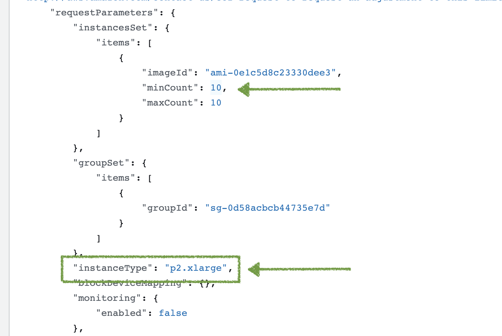

# Launch Unusual EC2 Instances


Platform: AWS

## MITRE ATT&CK Tactics


- Execution

## Description


Simulates an attacker attempting to spin up several high-powered EC2 instances (p2.xlarge) which are suitable to cryptomining.   
This attack technique ultimately fails for a couple reasons.   
  1. First, the IAM role assigned to the Instance Role used in the attack doesn't have the ec2:RunInstances permission.     
  2. Secondly a service quota needs to be increased to allow for these p2.xlarge instances to be created.  This module submits the service request, requesting the increase but it takes several days for the request to process and may not be approved when the attack technique is executed.


#### Attacker Actions: 

Attacker attempts to start (10) the EC2 instances.   
  - Resulting event name: `RunInstances`   
  - Required IAM Permission: `ec2:RunInstances`

#### Workflow Inputs: 
Specify which user this attack should run as. 
```json
{"user":"user01"}
{"user":"user02"}
```
#### Clean Up: 

None - no resources are modified.


## Execution Instructions

- See [User Guide](../../user-guide/execution-user-permissions.md) for Execution Instructions via the Google Cloud Console
- Programmatically execute this workflow with the following cli command:

```
gcloud workflows run aws-ec2-launch-unusual-instances-srt `--data={"user": "user01"}` 
```


## Detection Artifacts

The request parameters in the `RunInstances` AWS Event Name will reveal if unusual EC2 instances have been launched or have been attempted to be launched.


Refer to Stratus Red Team documentation for additional detailed [detection artifacts](https://stratus-red-team.cloud/attack-techniques/AWS/aws.execution.ec2-launch-unusual-instances/) produced by this attack technique.

