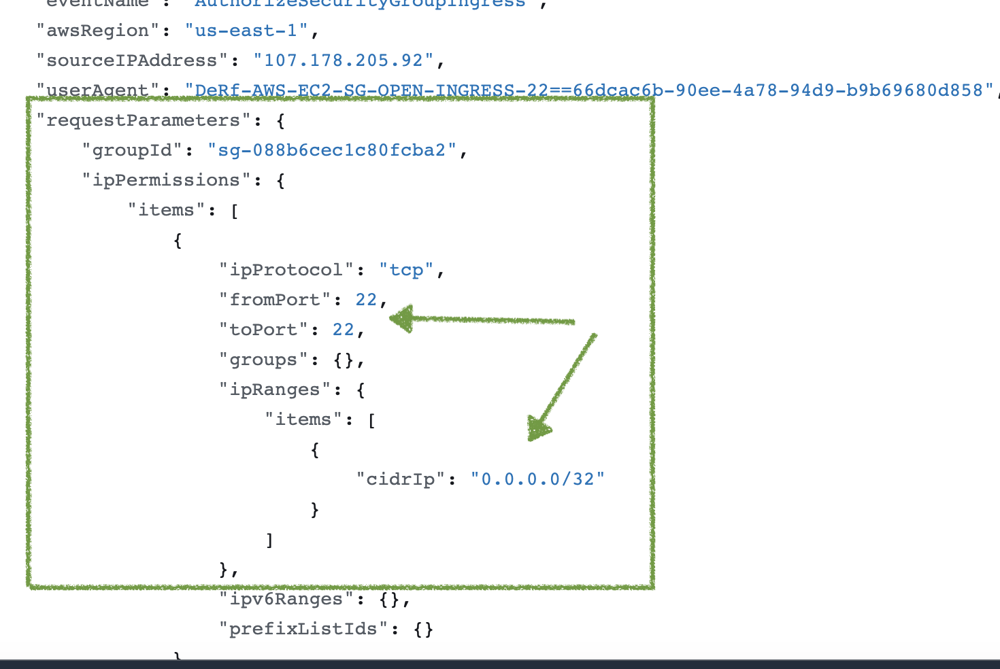

# Open Ingress Port 22 on a Security Group


Platform: AWS

## MITRE ATT&CK Tactics


- Exfiltration

## Description


Simulates an attacker loosening network restrictions to allow incoming SSH connections to an EC2 instance.  This is done by creating an ingress rule in a Security Group on port 22 from the Internet (0.0.0.0/0).


#### Attacker Actions: 

Attacker opens port 22 from the Internet (0.0.0.0/0) by updating inbound rules to a VPC security group:    
  - Resulting event name: `AuthorizeSecurityGroupIngress`   
  - Required IAM Permission: `ec2:AuthorizeSecurityGroupIngress`

#### Workflow Inputs: 
Specify which user this attack should run as. 
```json
{"user":"user01"}
{"user":"user02"}
```

#### Clean Up: 

DeRF Default Execution User reverts ingress rule update, closing the open port.


## Execution Instructions

- See [User Guide](../../user-guide/execution-user-permissions.md) for Execution Instructions via the Google Cloud Console
- Programmatically execute this workflow with the following cli command:

```
gcloud workflows run aws-ec2-launch-unusual-instances-srt `--data={"user": "user01"}` 
```


## Detection Artifacts

The request parameters in the `AuthorizeSecurityGroupIngress` AWS Event Name will reveal both the inbound allowed IP with the parameter `cidrIp` and the ports exposed, `fromPort` and `toPort`.



Refer to Stratus Red Team documentation for additional detailed [detection artifacts](https://stratus-red-team.cloud/attack-techniques/AWS/aws.exfiltration.ec2-security-group-open-port-22-ingress/) produced by this attack technique.

