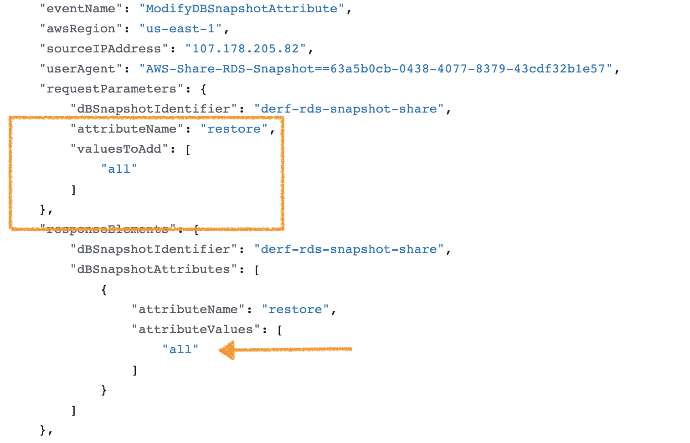

# Exfiltrate RDS Snapshot by Sharing


Platform: AWS

## MITRE ATT&CK Tactics


- Exfiltration

## Description


This attack has two different ways to share a RDS DB Snapshot externally.  
- The first option shares a RDS DB Snapshot with "all",  aka everyone.   
- The second case shares a RDS DB Snapshot with an external, fictitious AWS account, (012345678912)

#### Attacker Actions: 

- Calls the `ModifyDBSnapshotAttribute` API, adding the `restore` attribute and assigning that to the AWS Account, `012345678912` or `all`
  - Resulting event name: `ModifyDBSnapshotAttribute`
  - Assigned IAM Permission: `rds:ModifyDBSnapshotAttribute`

#### Workflow Inputs: 
Specify which user this attack should run as.   
```json
# Sharing the RDS DB Snapshot with "all", aka, publicly
{"case":"1","user":"user01"}
{"case":"1","user":"user02"}

# Sharing the RDS DB Snapshot with an external fictitious account
{"case":"2","user":"user01"}
{"case":"2","user":"user02"}
```

#### Clean Up: 

- Removes the external fictitious external AWS account or "all" from the `restore` attribute.
  - Executed as the `DeRF Default User`


## Execution Instructions

- See [User Guide](../../user-guide/execution-user-permissions.md) for Execution Instructions via the Google Cloud Console
- Programmatically execute this workflow with the following cli command:

```
gcloud workflows run aws-rds-share-snapshot-srt --data={"case":"1","user":"user01"}   

```


## Detection Artifacts


Identify when a RDS snapshot is shared with an external account, through CloudTrail's <code>ModifyDBSnapshotAttribute</code> event specifically when the `requestParameters.valuesToAdd` key either contains an external AWS Account or the string "all".




Refer to Stratus Red Team documentation for additional detailed [detection artifacts](https://stratus-red-team.cloud/attack-techniques/AWS/aws.exfiltration.rds-share-snapshot/) produced by this attack technique.

